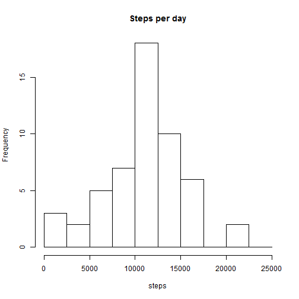
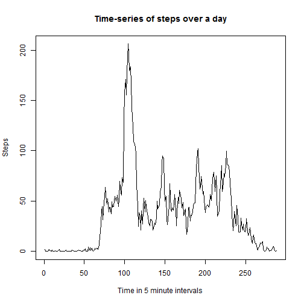
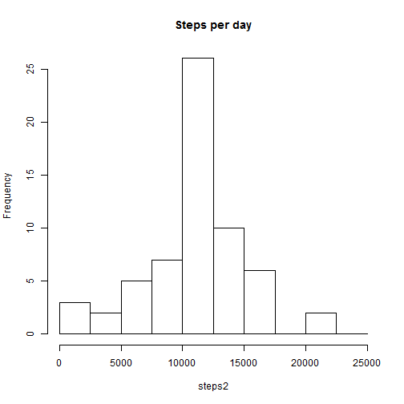

###Loading and preprocessing data
First, we will load the data, and filter out all NA data:


```r
data.raw<-read.csv("activity.csv")
data.clean<-data.raw[complete.cases(data.raw),]
```

###What is mean total number of steps taken per day?
Now we will create a histogram of the total number of steps each day. We will use the data.table library and the sum function to find the sum of all total steps per day:


```r
library(data.table)
data.clean<-as.data.table(data.clean)
steps<-data.clean[,{sum(steps)},by=date]$V1

hist(steps,breaks=seq(0,25000,2500),main="Steps per day")
```

 

We can calculate the mean and median total number of steps per day with:


```r
mean(steps)
```

```
## [1] 10766
```

```r
median(steps)
```

```
## [1] 10765
```

###What is the average daily activity pattern?

We will now calculate the 5 minute interval with the most number of steps, on average, across all days. We will first get all unique 5-minute intervals:


```r
intervals.uniq<-unique(data.clean$interval)
```
Now we will use the "which", "mean", and a "for loop" to find the average for each 5-minute interval:


```r
meanList<-NULL

for (i in 1:length(intervals.uniq)){
        
        meanList<-append(meanList,mean(data.clean$steps[which(data.clean$interval==intervals.uniq[i])],na.rm=TRUE))
        
        }
```

Finally we will graph this with a time-series plot by converting the meanList variable to a time-series object and plotting it:


```r
plot.ts(as.ts(meanList),xlab="Time in 5 minute intervals",ylab="Steps",main="Time-series of steps over a day")
```

 

We can find the 5 minute interval with the highest average number of steps with this command:

```r
which(meanList==max(meanList))
```

```
## [1] 104
```

This time period would be approximately 8:40AM.

###Imputing missing values

We can find the number of missing values with this code:


```r
length(data.raw$steps)-length(data.raw[complete.cases(data.raw),]$steps)
```

```
## [1] 2304
```

We will now fill in the NA values with the average 5 minute step counts for that particular time interval within the new variable data.filled:


```r
meanList<-cbind(intervals.uniq,meanList)

data.filled<-data.raw

for (i in 1:length(data.filled[,1])){
        
        if(is.na(data.filled$steps[i])){
                data.filled$steps[i]<-meanList[intervals.uniq==data.filled$interval[i],2]
                
                }
        
        }
```

I will now create a histogram of the steps taken per day, with the mean and median total steps per day:


```r
data.filled<-as.data.table(data.filled)

steps2<-data.filled[,{sum(steps)},by=date]$V1

hist(steps2,breaks=seq(0,25000,2500),main="Steps per day")
```

 

```r
mean(steps2)
```

```
## [1] 10766
```

```r
median(steps2)
```

```
## [1] 10766
```

We can see from the results above, that imputing the missing data had a very minor effect on the mean and median (the median increased by 1).

###Are there differences in activity patterns between weekdays and weekends?

We can find out if there are differences in activity patterns by adding another column called "day", with factors "weekday" and "weekend" to our data.filled table:


